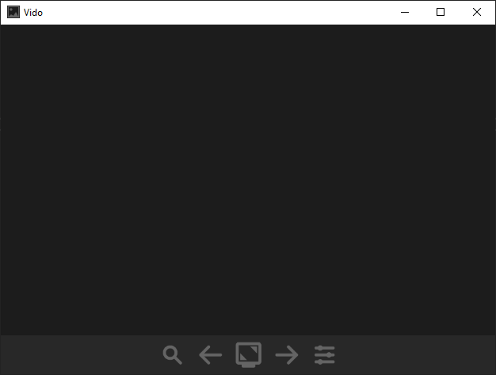

# Vido Image Viewer
A simple, lightweight, fast and sexy image viewer.

[**Download setup (0.1.3)**](https://github.com/bauermaximilian/Vido/releases/download/0.1.3/VidoSetup_0.1.3.exe)

[**Download portable ZIP file (0.1.3)**](https://github.com/bauermaximilian/Vido/releases/download/0.1.3/VidoPortable_0.1.3.zip)

## About
Every operating system has one included. There are tons of alternatives, supporting every imaginable image format, include handy image editing functions - and most of them are free, well-tested and have a big community. Why create yet another image viewer then?

The answer is simple: Because I couldn't find one I was *really* happy with.

I want an image viewer that is fast, doesn't annoy me with an overloaded Windows 95-like UI full of buttons or image editing features *I don't fucking need when looking at memes*. I just want an intuitive and customizable input scheme... and a dark theme. And so I did what most programmers would probably do: I made my own.

### The result

## Features
- Supports JPG, PNG, TIFF and (animated) GIF
- Intuitively controllable by keyboard, mouse, remote controls...
- Completely customizable key mappings and design
- Probably works on Linux as well (using mono)

### Planned future features
- Support for VR/Side-by-side and 360° pictures
- Smoother animations for larger pictures

## Current project state
As implied, the current version was created in 2018 within a few days. It lacks proper documentation and testing and should be rewritten from scratch, as the code quality is rather... suboptimal. Until there's enough time to tackle that, however, I will continue fixing (major) bugs that come to my attention.
